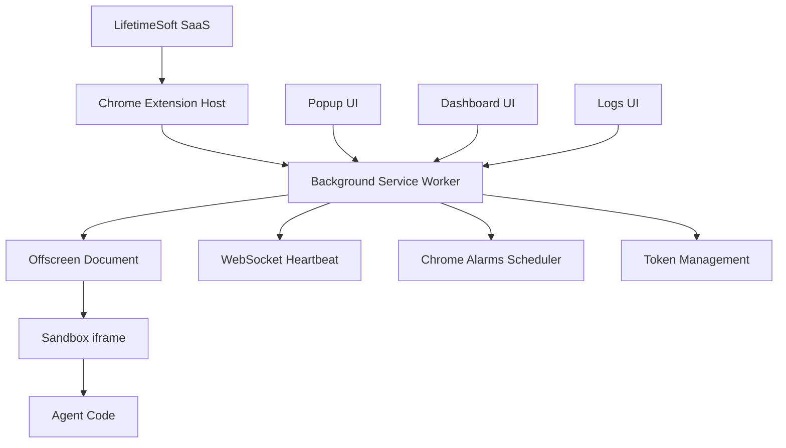

# LifetimeSoft Chrome Extension Host

Chrome Extension MV3 host application for running multiple AI agents built with `@lifetimesoft/agent-sdk`.

This extension acts as a **Host Application** for browser-based agents, similar to how Steam runs multiple games or Docker Desktop runs multiple containers.

[](https://chrome.google.com/webstore)
[](https://developer.chrome.com/docs/extensions/mv3/)
[](https://www.typescriptlang.org/)
[](./REFACTORING_SUMMARY.md)

---

## 🚀 Features

### Multi-Agent Management
- **Install** agents from the LifetimeSoft registry
- **Run multiple agents** simultaneously in a single extension
- **Start/Stop** agents with real-time status updates
- **Uninstall** agents with automatic cleanup

### Advanced Scheduling
- **Manual triggers** via SaaS dashboard or WebSocket
- **Interval scheduling** (e.g., every 10 minutes)
- **Cron expressions** (e.g., `0 9 * * 1-5` for weekdays at 9 AM)
- **Chrome Alarms** integration for reliable background execution

### Enterprise Authentication
- **Device flow login** with automatic token refresh
- **Session persistence** across service worker restarts
- **Secure token storage** in `chrome.storage.local`
- **Automatic logout** on token expiration

### Real-time Communication
- **WebSocket heartbeat** with auto-reconnect
- **Live configuration updates** from SaaS dashboard
- **Manual triggers** from web interface
- **Status synchronization** with platform

### Developer Experience
- **Structured logging** with job IDs and timestamps
- **Error handling** with detailed stack traces and custom error classes
- **Bundle caching** for faster agent execution
- **TypeScript** throughout with strict type checking
- **Retry logic** with exponential backoff for resilient API calls
- **Centralized constants** for easy configuration management
- **Comprehensive type definitions** for better IDE support

---

## 🏗️ Architecture



### Sandbox Execution Model

Agent code runs in a **sandboxed iframe** to comply with Chrome MV3 security requirements:

```text
Background SW
    ↓ chrome.runtime.sendMessage("offscreen_run")
Offscreen Document
    ↓ postMessage(agentCode, ctx)
Sandbox iframe
    ↓ new Function(agentCode)(ctx)
    ↑ postMessage(logs, results)
Background SW
    ↑ chrome.runtime.sendMessage(response)
```

**Security Benefits:**
- Agent code cannot access `chrome.*` APIs directly
- Complete isolation from extension context
- CSP-compliant dynamic code execution
- Proxy-based API access control

---

## 🔧 Capabilities & Compatibility

The host performs compatibility checks before installing agents:

| Capability | Chrome Host | Node.js Host |
|------------|-------------|--------------|
| `ai.chat` | ✅ | ✅ |
| `ai.image` | ✅ | ✅ |
| `ai.video` | ✅ | ✅ |
| `storage.kv` | ✅ | ✅ |
| `queue.push` | ✅ | ✅ |
| `system.fs` | ❌ | ✅ |
| `system.process` | ❌ | ✅ |
| `system.network` | ❌ | ✅ |

Agents requiring unsupported capabilities will show a clear error message during installation.

---

## 📋 Agent Lifecycle

### 1. Install Agent
```bash
# Via Dashboard UI
Install → hello-world-agent@latest
```

1. **Compatibility Check**: `GET /agents/info?name=hello-world-agent&host=chrome`
2. **Metadata Storage**: Save to `chrome.storage.local`
3. **Initial State**: Agent starts in `stopped` status

### 2. Start Agent
```bash
# Via Dashboard UI or API
Start → hello-world-agent
```

1. **Bundle Fetch**: `POST /agents/pull` → decompress `.tar.gz`
2. **Context Creation**: Build agent context with config/env
3. **Sandbox Execution**: Load code in sandboxed iframe
4. **Scheduler Setup**: Configure `chrome.alarms` based on schedule
5. **Status Update**: Mark as `running`

### 3. Runtime Execution
```bash
# Automatic based on scheduler config
{ "type": "interval", "value": 600000 }  # Every 10 minutes
{ "type": "cron", "value": "0 */2 * * *" }  # Every 2 hours
{ "type": "none" }  # Manual triggers only
```

### 4. Stop Agent
```bash
# Via Dashboard UI
Stop → hello-world-agent
```

1. **Scheduler Cleanup**: Clear `chrome.alarms`
2. **Sandbox Termination**: Send stop signal to iframe
3. **Status Update**: Mark as `stopped`
4. **Resource Cleanup**: Clear timers and connections

---

## 🎯 Scheduling System

### Scheduler Types

#### Manual Triggers (`type: "none"`)
```json
{
  "type": "none"
}
```
- Agent runs only when triggered manually
- Triggers via SaaS dashboard or WebSocket messages
- Ideal for event-driven workflows

#### Interval Scheduling (`type: "interval"`)
```json
{
  "type": "interval",
  "value": 300000
}
```
- Runs every N milliseconds
- Minimum interval: 1 minute (Chrome limitation)
- Perfect for regular data processing

#### Cron Scheduling (`type: "cron"`)
```json
{
  "type": "cron",
  "value": "0 9 * * 1-5"
}
```
- Standard cron expressions (5 fields)
- Checked every minute for precision
- Great for business hour automation

### Implementation Details

```typescript
// Chrome Alarms API integration
chrome.alarms.create(`lts_scheduler_${agentName}`, {
  delayInMinutes: intervalMinutes,
  periodInMinutes: intervalMinutes
})

// Cron expression matching
function shouldTriggerCron(cronExpr: string): boolean {
  const now = new Date()
  return matchesCronExpression(cronExpr, now)
}
```

---

## 🖥️ User Interface

### Popup (Quick Access)
- **Login Status**: Visual indicator with user info
- **Agent Count**: Running vs total agents
- **Quick Actions**: Open dashboard, view logs
- **Status Dot**: Green (running) / Yellow (stopped) / Red (error)

### Dashboard (Full Management)
- **Agent Grid**: Visual cards with status badges
- **Install Form**: Name + version input with validation
- **Bulk Actions**: Start all, stop all, disconnect
- **Real-time Updates**: Live status synchronization

### Logs Viewer
- **Structured Logs**: Job IDs, timestamps, levels
- **Agent Filtering**: View logs per agent
- **Log Levels**: Info, warn, error, debug
- **Export**: Download logs as JSON/text

---

## 🔐 Security & Privacy

### Token Management
- **Secure Storage**: Tokens stored in `chrome.storage.local`
- **Automatic Refresh**: Seamless token renewal
- **Expiration Handling**: Graceful logout on invalid tokens
- **No Plaintext**: Tokens never logged or exposed

### Sandbox Security
- **Code Isolation**: Agent code cannot access extension APIs
- **CSP Compliance**: Satisfies Chrome's Content Security Policy
- **API Proxying**: Controlled access to platform APIs
- **Resource Limits**: Timeout and memory constraints

### Network Security
- **HTTPS Only**: All API calls use secure connections
- **Token Authentication**: Bearer token for all requests
- **CORS Compliance**: Proper origin validation
- **Rate Limiting**: Respects platform rate limits

---

## 🛠️ Development

### Prerequisites
```bash
node >= 18.0.0
npm >= 9.0.0
```

### Setup
```bash
# Clone repository
git clone https://github.com/lifetimesoft/chrome-extension-host
cd chrome-extension-host

# Install dependencies
npm install

# Build extension
npm run build
```

### Development Workflow
```bash
# Watch mode (rebuilds on changes)
npm run dev

# Type checking
npm run type-check

# Linting
npm run lint

# Testing
npm run test
```

### Loading in Chrome
1. Open `chrome://extensions/`
2. Enable **Developer mode**
3. Click **Load unpacked**
4. Select the `dist/` directory
5. Pin the extension to toolbar

---

## 📁 Project Structure

```text
chrome-extension-host/
├── src/
│   ├── background/           # Service worker entry point
│   │   └── index.ts         # Main background script
│   ├── popup/               # Extension popup UI
│   │   ├── index.html
│   │   ├── index.ts
│   │   └── styles.css
│   ├── dashboard/           # Full-page management UI
│   │   ├── index.html
│   │   ├── index.ts
│   │   └── styles.css
│   ├── offscreen/           # Offscreen document (sandbox bridge)
│   │   ├── index.html
│   │   └── index.ts
│   ├── sandbox/             # Sandboxed iframe (agent execution)
│   │   └── index.html
│   ├── logs/                # Log viewer UI
│   │   ├── index.html
│   │   ├── index.ts
│   │   └── styles.css
│   ├── services/            # Core business logic
│   │   ├── agent.service.ts      # Agent management
│   │   ├── auth.service.ts       # Authentication
│   │   ├── heartbeat.service.ts  # WebSocket communication
│   │   ├── runtime.service.ts    # Agent runtime
│   │   ├── sandbox.service.ts    # Sandbox execution
│   │   └── scheduler.service.ts  # Scheduling system
│   ├── storage/             # Data persistence
│   │   └── storage.ts       # chrome.storage wrappers
│   ├── utils/               # Shared utilities
│   │   ├── api-helper.ts    # HTTP client with token refresh
│   │   ├── common.ts        # Common utility functions
│   │   └── logger.ts        # Structured logging
│   ├── constants.ts         # Centralized application constants
│   └── types.ts             # Comprehensive TypeScript type definitions
├── dist/                    # Built extension (generated)
├── manifest.json            # Chrome extension manifest
├── package.json
├── tsconfig.json
├── build.mjs               # Build script
└── REFACTORING_SUMMARY.md  # Code quality improvements documentation
```

### Code Organization

The codebase follows a **modular architecture** with clear separation of concerns:

#### **Constants** (`src/constants.ts`)
Centralized configuration for:
- API URLs and endpoints
- Timing values (intervals, timeouts, delays)
- Storage keys and alarm names
- Agent status values
- Message type definitions

#### **Types** (`src/types.ts`)
Comprehensive TypeScript definitions:
- Agent and runtime types
- Message and API response types
- Custom error classes (`AuthError`, `AgentError`, `SandboxError`)
- Scheduler and configuration types

#### **Utilities** (`src/utils/common.ts`)
Reusable helper functions:
- ID generation and date formatting
- Token validation and expiration checks
- Async utilities (retry, sleep, debounce, throttle)
- Storage and alarm key helpers

---

## 🔄 Runtime APIs

Agents access platform APIs through the context object:

### AI Services
```typescript
// Chat completion
const response = await ctx.ai.chat({
  messages: [{ role: "user", content: "Hello!" }],
  model: "gpt-4"
})

// Image generation
const image = await ctx.ai.image({
  prompt: "A sunset over mountains",
  size: "1024x1024"
})

// Video generation
const video = await ctx.ai.video({
  prompt: "A cat playing with yarn",
  duration: 5
})
```

### Storage
```typescript
// Key-value storage
await ctx.storage.set("user_count", 42, { ttl: 3600 })
const count = await ctx.storage.get<number>("user_count")
await ctx.storage.delete("user_count")
```

### Logging
```typescript
// Structured logging with job context
ctx.log.info("Processing started", { userId: 123 })
ctx.log.warn("Rate limit approaching", { remaining: 10 })
ctx.log.error("API call failed", { error: "timeout" })
```

### Queue
```typescript
// Push data to processing queue
await ctx.queue.push({
  type: "email",
  recipient: "user@example.com",
  template: "welcome"
})
```

---

## 🌐 Integration

### LifetimeSoft Platform
- **Registry API**: Agent discovery and installation
- **Runtime API**: Context and configuration management
- **WebSocket API**: Real-time triggers and updates
- **AI API**: Chat, image, and video generation

### Chrome Extension APIs
- **chrome.storage**: Persistent data storage
- **chrome.alarms**: Reliable background scheduling
- **chrome.runtime**: Message passing and lifecycle
- **chrome.offscreen**: Sandbox document management

---

## 💎 Code Quality & Architecture

### Recent Refactoring (2024)

The codebase underwent a comprehensive refactoring to improve maintainability, type safety, and reliability:

#### **Centralized Constants**
All configuration values are now in a single location (`src/constants.ts`):
- API endpoints and URLs
- Timing values (intervals, timeouts, delays)
- Storage keys and alarm names
- Message type definitions
- Agent status constants

**Benefits:**
- Single source of truth for configuration
- Easy to update URLs and timeouts
- No magic strings or numbers in code
- Better IDE autocomplete support

#### **Comprehensive Type Definitions**
Strong TypeScript typing throughout (`src/types.ts`):
- Agent and runtime types
- Message and API response interfaces
- Custom error classes
- Scheduler and configuration types

**Benefits:**
- Compile-time error detection
- Better IDE support and refactoring
- Self-documenting code
- Reduced runtime errors

#### **Shared Utilities**
Reusable helper functions (`src/utils/common.ts`):
- `generateJobId()` - Unique job identifiers
- `formatDate()` - Consistent timestamp formatting
- `isTokenExpired()` - JWT validation
- `retry()` - Exponential backoff retry logic
- `sleep()`, `debounce()`, `throttle()` - Async utilities

**Benefits:**
- No code duplication
- Consistent behavior across services
- Easy to test and maintain
- Reusable across projects

#### **Error Handling**
Custom error classes with context:
```typescript
class AuthError extends ExtensionError {
  constructor(message: string, details?: unknown) {
    super(message, "AUTH_ERROR", details)
  }
}

class AgentError extends ExtensionError {
  constructor(message: string, details?: unknown) {
    super(message, "AGENT_ERROR", details)
  }
}
```

**Benefits:**
- Better error categorization
- Detailed error context
- Easier debugging
- Proper error propagation

#### **Retry Logic**
Automatic retry with exponential backoff for transient failures:
```typescript
// Retry API calls up to 3 times with exponential backoff
const response = await retry(
  () => apiCall("/agents/info"),
  3,    // max attempts
  1000  // base delay (ms)
)
// Delays: 1s, 2s, 4s
```

**Benefits:**
- Resilient to network issues
- Handles transient failures
- Configurable retry strategy
- Reduces manual error handling

### Architecture Principles

1. **Separation of Concerns**: Each service has a single responsibility
2. **Dependency Injection**: Services are loosely coupled
3. **Type Safety**: Strong typing throughout the codebase
4. **Error Handling**: Comprehensive error handling with custom error classes
5. **Code Reusability**: Shared utilities and constants
6. **Maintainability**: Clear code organization and documentation

### Performance Optimizations

- **Bundle Caching**: Agent bundles cached in memory
- **Lazy Loading**: UI components loaded on demand
- **Efficient Storage**: Minimal chrome.storage operations
- **WebSocket Reuse**: Single connection per agent
- **Alarm Optimization**: Minimal alarm usage

---

## 🔍 Monitoring & Debugging

### Logging System
```text
[2024-01-15 10:30:45] [job:a1b2c3] [agent:info] [scheduler] start job a1b2c3
[2024-01-15 10:30:45] [job:a1b2c3] [agent:info] Processing 5 items
[2024-01-15 10:30:46] [job:a1b2c3] [agent:info] [scheduler] end job a1b2c3
[2024-01-15 10:30:46] [job:a1b2c3] [agent:info] ----------
```

### Debug Tools
- **Chrome DevTools**: Service worker debugging
- **Extension Logs**: Structured log viewer
- **Network Tab**: API call monitoring
- **Storage Inspector**: Data persistence debugging

### Error Handling
```typescript
// Custom error types for better error handling
class AgentError extends ExtensionError {
  constructor(message: string, details?: unknown) {
    super(message, "AGENT_ERROR", details)
    this.name = "AgentError"
  }
}

class AuthError extends ExtensionError {
  constructor(message: string, details?: unknown) {
    super(message, "AUTH_ERROR", details)
    this.name = "AuthError"
  }
}

// Automatic retry with exponential backoff
import { retry } from "./utils/common"

await retry(async () => {
  return await apiCall("/agents/info")
}, 3, 1000)  // 3 attempts, 1 second base delay

// Retry delays: 1s, 2s, 4s (exponential backoff)
```

### Code Quality Features

#### **Centralized Configuration**
```typescript
// All constants in one place
import { API_URLS, TIMING, STORAGE_KEYS, AGENT_STATUS } from "./constants"

// Easy to update and maintain
const response = await fetch(`${API_URLS.AGENT_BASE}/agents/info`)
setTimeout(reconnect, TIMING.RECONNECT_DELAY)
```

#### **Type Safety**
```typescript
// Comprehensive type definitions
import type { InstalledAgent, AgentInfoResponse, SchedulerConfig } from "./types"

// Better IDE support and compile-time checks
const agent: InstalledAgent = {
  name: "hello-world",
  version: "1.0.0",
  status: AGENT_STATUS.RUNNING,
  installed_at: Date.now(),
  config: {}
}
```

#### **Utility Functions**
```typescript
// Reusable helpers
import { generateJobId, formatDate, isTokenExpired } from "./utils/common"

const jobId = generateJobId()  // "a1b2c3"
const timestamp = formatDate()  // "2024-01-15 10:30:45"
const expired = isTokenExpired(token)  // true/false
```

---

## 🚀 Deployment

### Chrome Web Store
1. **Build Production**: `npm run build`
2. **Create Package**: Zip the `dist/` directory
3. **Upload**: Submit to Chrome Web Store
4. **Review Process**: Wait for Google approval

### Enterprise Distribution
1. **Policy Configuration**: Set up Chrome Enterprise policies
2. **Force Installation**: Deploy via Google Admin Console
3. **Configuration Management**: Centralized settings
4. **Update Management**: Automatic or manual updates

---

## 🤝 Contributing

### Development Setup
```bash
# Fork the repository
git clone https://github.com/your-username/chrome-extension-host
cd chrome-extension-host

# Create feature branch
git checkout -b feature/amazing-feature

# Make changes and test
npm run build
npm run test

# Submit pull request
git push origin feature/amazing-feature
```

### Code Standards
- **TypeScript**: Strict mode enabled with comprehensive type definitions
- **ESLint**: Airbnb configuration
- **Prettier**: Automatic code formatting
- **Conventional Commits**: Semantic commit messages
- **Modular Architecture**: Clear separation of concerns
- **Error Handling**: Custom error classes with retry logic
- **Code Reusability**: Shared utilities and constants

### Recent Improvements (2024)
- ✅ **Refactored codebase** with centralized constants and types
- ✅ **Added retry logic** with exponential backoff for API calls
- ✅ **Custom error classes** for better error handling
- ✅ **Eliminated code duplication** across services
- ✅ **Improved type safety** with comprehensive TypeScript types
- ✅ **Better maintainability** with shared utilities
- ✅ **Enhanced developer experience** with better IDE support

See [REFACTORING_SUMMARY.md](REFACTORING_SUMMARY.md) for detailed information.

---

## 📊 Comparison with Other Hosts

| Feature | Chrome Extension | Node.js (lifectl) | Future: Mobile |
|---------|------------------|-------------------|----------------|
| **Platform** | Browser | Server/Desktop | iOS/Android |
| **Scheduling** | chrome.alarms | node-cron | Background tasks |
| **File System** | ❌ | ✅ | Limited |
| **Network** | Fetch API | Full access | Restricted |
| **UI Integration** | Chrome UI | Terminal | Native UI |
| **Distribution** | Web Store | npm/binary | App Store |
| **Auto-update** | Automatic | Manual/CI | Automatic |

---

## 🎯 Roadmap

### Recently Completed ✅
- **Code Refactoring**: Centralized constants, types, and utilities
- **Error Handling**: Custom error classes with retry logic
- **Type Safety**: Comprehensive TypeScript type definitions
- **Code Quality**: Eliminated duplication, improved maintainability

### Short Term
- [ ] **Performance Optimization**: Bundle size reduction
- [ ] **Enhanced Logging**: Log filtering and search
- [ ] **Backup/Restore**: Agent configuration export
- [ ] **Offline Support**: Limited offline functionality
- [ ] **Unit Tests**: Comprehensive test coverage

### Medium Term
- [ ] **Agent Marketplace**: In-extension agent discovery
- [ ] **Custom Schedulers**: User-defined scheduling logic
- [ ] **Monitoring Dashboard**: Performance metrics
- [ ] **Team Management**: Multi-user agent sharing
- [ ] **Configuration Profiles**: Environment-specific settings

### Long Term
- [ ] **Mobile Support**: React Native host application
- [ ] **Desktop App**: Electron-based host
- [ ] **Edge Runtime**: Cloudflare Workers integration
- [ ] **Plugin System**: Extensible capability framework

---

## 📄 License

MIT License - see [LICENSE](LICENSE) file for details.

---

## 🆘 Support

- **Documentation**: [docs.lifetimesoft.com](https://docs.lifetimesoft.com)
- **Issues**: [GitHub Issues](https://github.com/lifetimesoft/chrome-extension-host/issues)
- **Discord**: [LifetimeSoft Community](https://discord.gg/lifetimesoft)
- **Email**: support@lifetimesoft.com

---

**Write Agent Once, Run Anywhere.** 🌍
